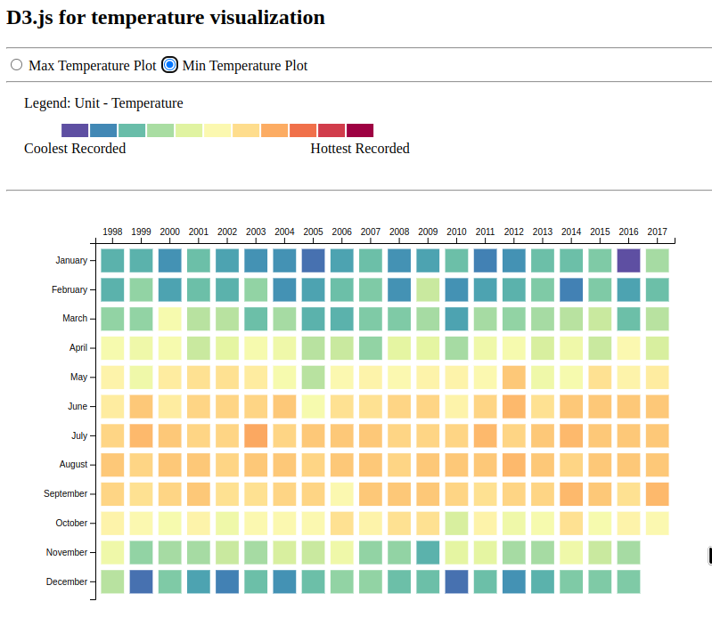

# CSCE-679-Data-Visualization-Assignment2

## Level 1 & 2 (Basic): [Link](./level1.md)
HK Temperature Heatmap

## Grading:
1. Correctness (50%): The data visualizations generated should look the same.
2. Redability (30%): The code should be human-readable (i.e., the name of the variables and functions should be intuitive, and there should be enough comments).
3. Maintainability (20%): The code should be modulized and easily modified.

## Submission Details:

- The code for level 1 is in `part1.html` and `part1.js`. Please open `part1.html` in your browswer to see it in action.
- The code for level 2 is in `part2.html` and `part2.js`. Please open `part2.html` in your browswer to see it in action.

Below are the screenshots of both parts, as seen in my browser.

### Part 1:

### Part 2:

